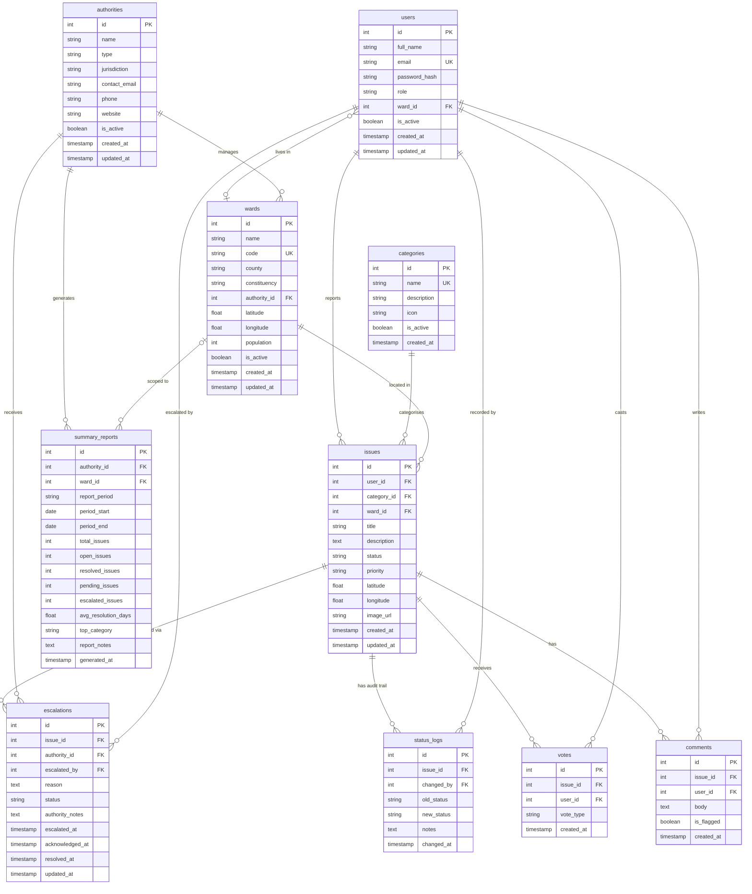

# IS PROJECT — Combined Entity Relationship Diagram
### Chapter 4 · System Design · ERD Section

> **Diagram format**: Mermaid ER Diagram — renders natively on GitHub and most Markdown viewers.
> **Ownership**: Partner A owns tables 1–5 · Partner B owns tables 6–10.

---

---

## Table Ownership Summary

| # | Table | Owner | Description |
|---|-------|-------|-------------|
| 1 | `users` | Partner A | Registered citizens and admin accounts |
| 2 | `categories` | Partner A | Issue classification taxonomy |
| 3 | `issues` | Partner A | Core civic issue records |
| 4 | `comments` | Partner A | Public discussion on issues |
| 5 | `votes` | Partner A | Citizen upvotes/downvotes on issues |
| 6 | `authorities` | **Partner B** | Civic/government bodies |
| 7 | `wards` | **Partner B** | Administrative geographic units |
| 8 | `escalations` | **Partner B** | Formal issue escalations to authorities |
| 9 | `status_logs` | **Partner B** | Immutable audit log of status changes |
| 10 | `summary_reports` | **Partner B** | Aggregated periodic reports |

## Key Design Decisions

- **`status_logs` is append-only** — enforced by PostgreSQL `RULE` statements preventing `UPDATE` and `DELETE`. This guarantees a tamper-proof audit trail.
- **`summary_reports` deduplication** — a `UNIQUE` constraint on `(authority_id, ward_id, report_period, period_start)` prevents duplicate reports for the same scope and time window.
- **Soft deletes on reference tables** — `authorities` and `wards` use an `is_active` flag instead of hard deletion so historical escalations and reports remain intact.
- **`set_updated_at()` trigger** — a shared reusable trigger function keeps `updated_at` accurate across `authorities`, `wards`, and `escalations` without duplicating logic.
- **`ward_id` nullable on `summary_reports`** — a `NULL` ward means the report covers the authority's entire jurisdiction, allowing both granular and aggregate views.

---

## CivicPulse IPO+S Module Flow (Implementation Alignment)

This project follows the requested **Input → Processing → Storage → Output** architecture with role-aware modules:

### 1) Resident flow

- **Input**: `POST /api/reports` from resident-facing submission UI (`client/src/app/reports/new/page.tsx`).
- **Processing**: JWT + RBAC in `server/middleware/auth.js` and resident auth flow in `server/controllers/authController.js`.
- **Storage**: `users`, `reports`, `upvotes`, `wards`.
- **Output**: Public + resident views (`/reports`, `/ward-map`, `/my-reports`) reflect status and engagement.

### 2) Authority Officer flow

- **Input**: Officer access via `/officer` and authority APIs under `server/routes/authority.js`.
- **Processing**: Authority routing + assignment logic in `server/controllers/authorityController.js` with role enforcement (`requireRole('authority')`).
- **Storage**: `authorities`, `category_authority_map`, `reports` (+ `status_logs` / `escalations` when enabled).
- **Output**: Officer queue + status/note actions via officer dashboard.

### 3) Administrator flow

- **Input**: Admin access via `/admin` and admin APIs under `server/routes/admin.js`.
- **Processing**: User/ward/category/authority management and routing configuration in `server/controllers/adminController.js`.
- **Storage**: `users`, `categories`, `wards`, `authorities`, `category_authority_map`.
- **Output**: Admin control panel with role and routing controls.

### 4) Automated System flow

- **Input**: Scheduled job trigger (`node-cron`) in `server/server.js`.
- **Processing**: Overdue escalation checks + weekly analytics generation modules.
- **Storage**: Canonical `analytics` + `sessions` tables (with `summary_reports` still available for authority-period summaries).
- **Output**: Weekly analytics snapshots + overdue escalation alerts (API + email when SMTP is configured).

### Table naming compatibility notes

- Canonical shared tables are now implemented directly: **`audit_trail`**, **`analytics`**, **`sessions`** (Migration `015_create_flow_contract_tables.sql`).
- **`status_logs`** remains the immutable operational status log; inserts are synchronized into **`audit_trail`** via DB trigger.
- **`summary_reports`** remains authority/ward reporting output, while **`analytics`** stores weekly system-level KPI snapshots.
- Architectural term **`issues`** maps to implementation table **`reports`**.

### Module-to-implementation contract (Backend)

| Logical module | Route file | Controller file |
|---|---|---|
| Report Submission | `server/routes/reports.js` | `server/controllers/reportController.js` |
| Authentication & Role Manager | `server/routes/auth.js` | `server/controllers/authController.js` |
| Authority Routing Engine | `server/routes/routing.js` | `server/controllers/routingController.js` |
| Officer Login & Case Access | `server/routes/officer.js` | `server/controllers/officerController.js` |
| Admin Login & Configuration | `server/routes/admin.js` | `server/controllers/adminController.js` |
| Escalation Engine & Audit Logger | `server/routes/escalation.js` | `server/controllers/escalationController.js` |
| Automated Triggers / Cron Job | `server/routes/automation.js` + `server/jobs/*.js` | `server/controllers/automationController.js` |
| Analytics & Reporting Engine | `server/routes/analytics.js` | `server/controllers/analyticsController.js` |
